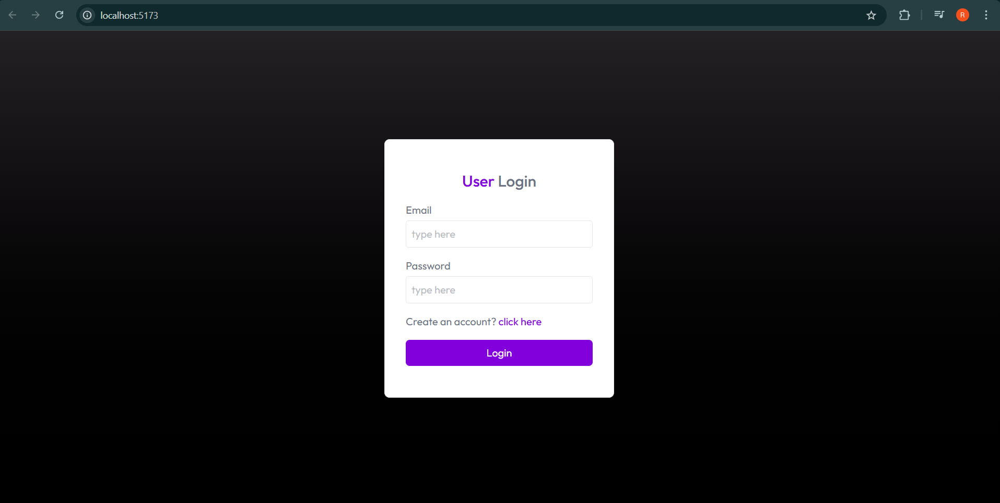
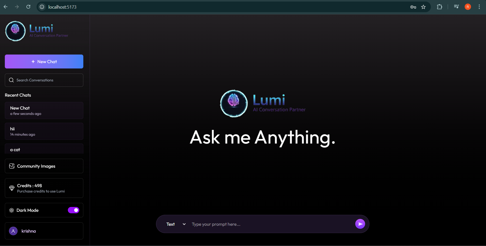
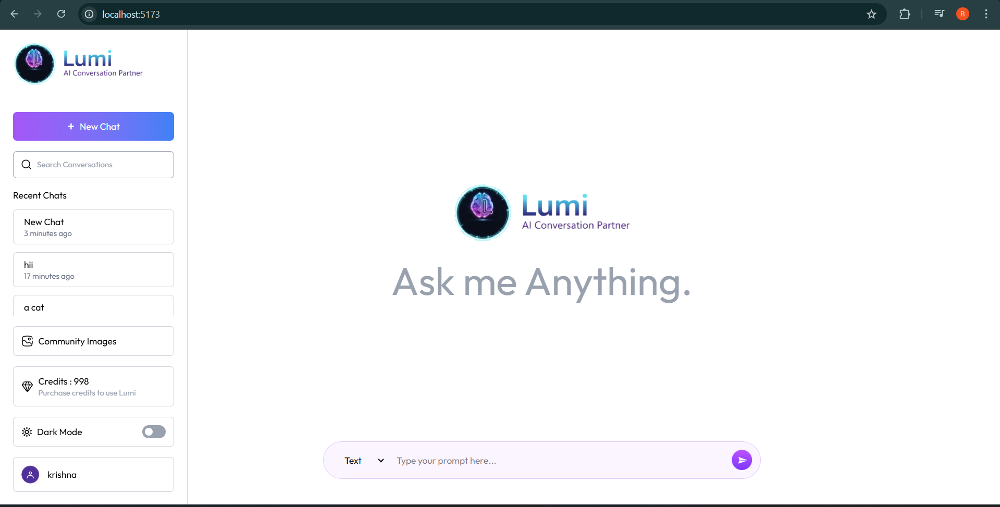
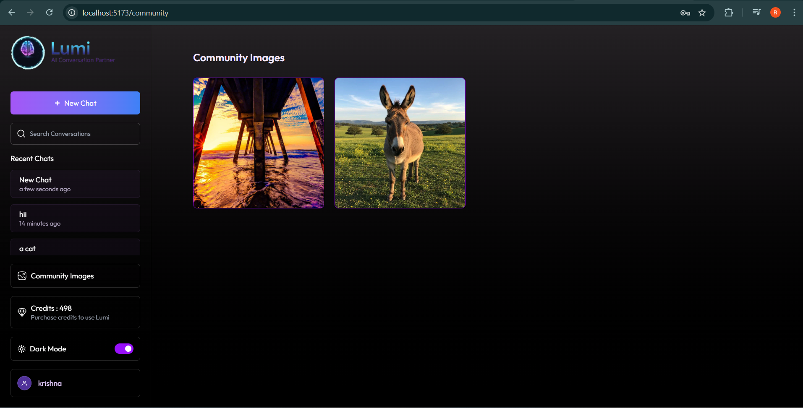
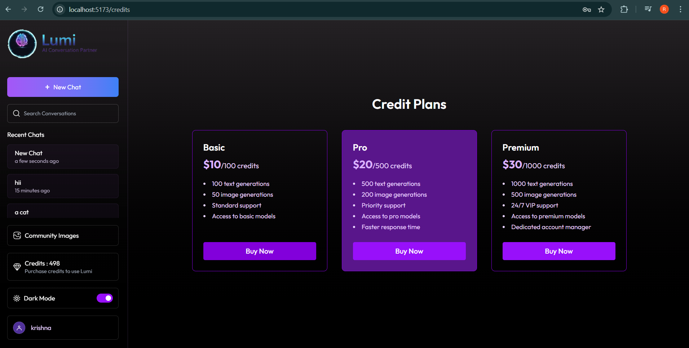
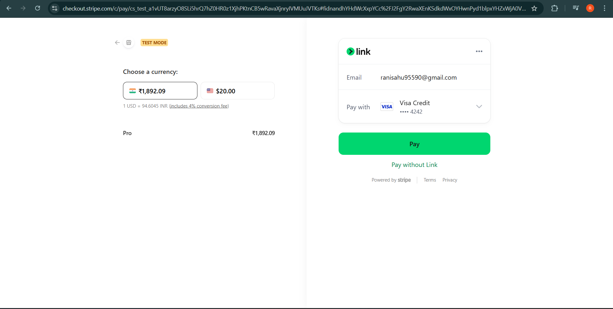

# ✨ Lumi — AI Chat Application

> **Lumi** is a modern, full-stack **AI-powered chat application** inspired by ChatGPT, built using the **MERN Stack**.  
> Chat with AI, generate images from prompts, and purchase credits online — all in one seamless experience.

---

# 🌐 Live Demo

🚀 **Frontend:** https://lumi-henna.vercel.app
🚀 **Backend API:** https://lumi-server-dusky.vercel.app

---

# 📸 Screenshots

## 🔐 Login Page

## 🏠 Home Page

## 👥 Community Page

## 💰 Credits Page

## 💳 Payment Page

---

## 🚀 What Lumi Offers

Lumi demonstrates **real-world full-stack development** by combining AI, authentication, payments, and scalable backend architecture into a single production-ready application.

---

## 🤖 AI Capabilities

- 💬 Text-based AI conversations
- 🖼️ Image generation from text prompts
- ⚡ Powered by **Google Gemini AI**
- ☁️ Image generation & storage using **ImageKit**

---

## 👤 User System

- 🔐 Secure user signup & login
- 🪪 JWT-based authentication
- 💳 Credit-based usage system
- 🗂️ User-specific chat history

---

## 💬 Chat Experience

- 🧵 Multiple chat sessions per user
- 💾 Persistent chat history stored in MongoDB
- 🖼️ Supports both text & image messages

---

## 💳 Payments

- 💰 Online credit purchase using **Stripe Payment Gateway**
- 🔒 Secure and scalable payment flow

---

## 🛠️ Tech Stack

### Frontend

- ⚛️ React.js
- 🎨 OpenAI React package (UI integration)
- 📱 Responsive & modern UI

### Backend

- 🟢 Node.js
- 🚀 Express.js
- 🍃 MongoDB (Mongoose)
- 🔐 JWT Authentication

### AI & Media

- 🧠 Google Gemini API
- 🖼️ ImageKit (image generation & storage)

### Payments

- 💳 Stripe Payment Gateway

---

## 🧪 Usage Flow

1. 👤 User signs up / logs in
2. 🎁 User receives free credits
3. ⚡ Credits are used to:
   - Generate AI text
   - Generate
4. 💳 User can purchase more credits
5. 🔒 All chats & images are stored securely

---

## 🎯 Why Lumi?

- ✅ End-to-end MERN stack project
- 🤖 Real-world AI + payment integration
- 🧱 Clean backend architecture
- 📈 Scalable credit-based system
- 💼 Strong portfolio project for **internships & placements**

---

## 🔮 Future Enhancements

- 🔄 Streaming AI responses
- 📄 Chat export (PDF / TXT)
- 🎙️ Voice input & output
- 🧑‍💼 Admin dashboard
- 📊 Usage analytics

---

## ⭐ Support

If you like this project:

- ⭐ Star the repository
- 🍴 Fork it
- 🐛 Report issues
- 💡 Suggest features

---
